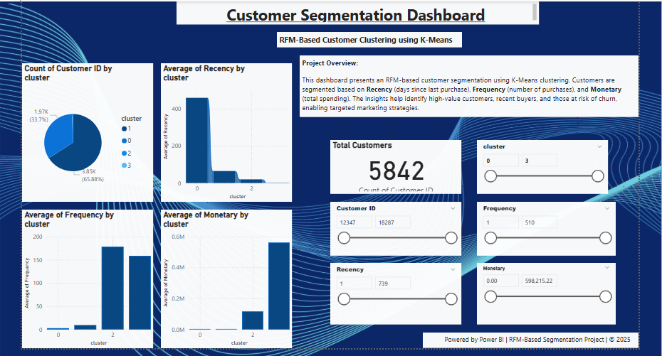

# Customer Segmentation using RFM

# Customer Segmentation using RFM Analysis + K-Means

## 📌 Overview
This project segments customers based on Recency, Frequency, and Monetary (RFM) values using K-Means clustering. The objective is to identify loyal customers, recent buyers, and customers likely to churn.

## 🛠️ Tools Used
- Python (pandas, matplotlib, sklearn)
- MySQL Workbench (for SQL-based exploration)
- Power BI (interactive dashboard)

## 🔍 SQL Sample Queries
- View high-value customers
- Churn risk customers
- Segment-wise customer distribution

## 📁 Files Included
- `Customer_Segmentation_using_RFM_Analysis_...ipynb`: Colab notebook with full Python workflow.
- `rfm_queries1.sql`: SQL queries for extracting insights.
- `Customer Segmentation Dashboard.pbix`: Interactive Power BI dashboard.
- `Customer_SegmentationRFM_dashboard.png`: Screenshot of the dashboard.
- 
## 🚀 Key Insights
- Cluster 0: Most frequent, high spenders
- Cluster 1: Loyal, recent buyers
- Cluster 2: High spenders but inactive recently
- Cluster 3: At risk (low frequency, high recency)

## 📊 Dashboard Preview

